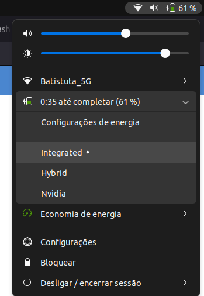

# What is this?
A simple automatic installer of [envycontrol](https://github.com/bayasdev/envycontrol) and [gpu profile selector](https://extensions.gnome.org/extension/5009/gpu-profile-selector/) for switch between integrated or dedicated gpus in Ubuntu 22

using GUI:



using console:

```bash
sudo envycontrol -s integrated
```

```bash
sudo envycontrol -s hybrid --rtd3
```

```bash
sudo envycontrol -s nvidia --force-comp --coolbits 24
```

```bash
sudo envycontrol -s nvidia --dm lightdm
```

# references
- https://github.com/bayasdev/envycontrol
- https://extensions.gnome.org/extension/5009/gpu-profile-selector/